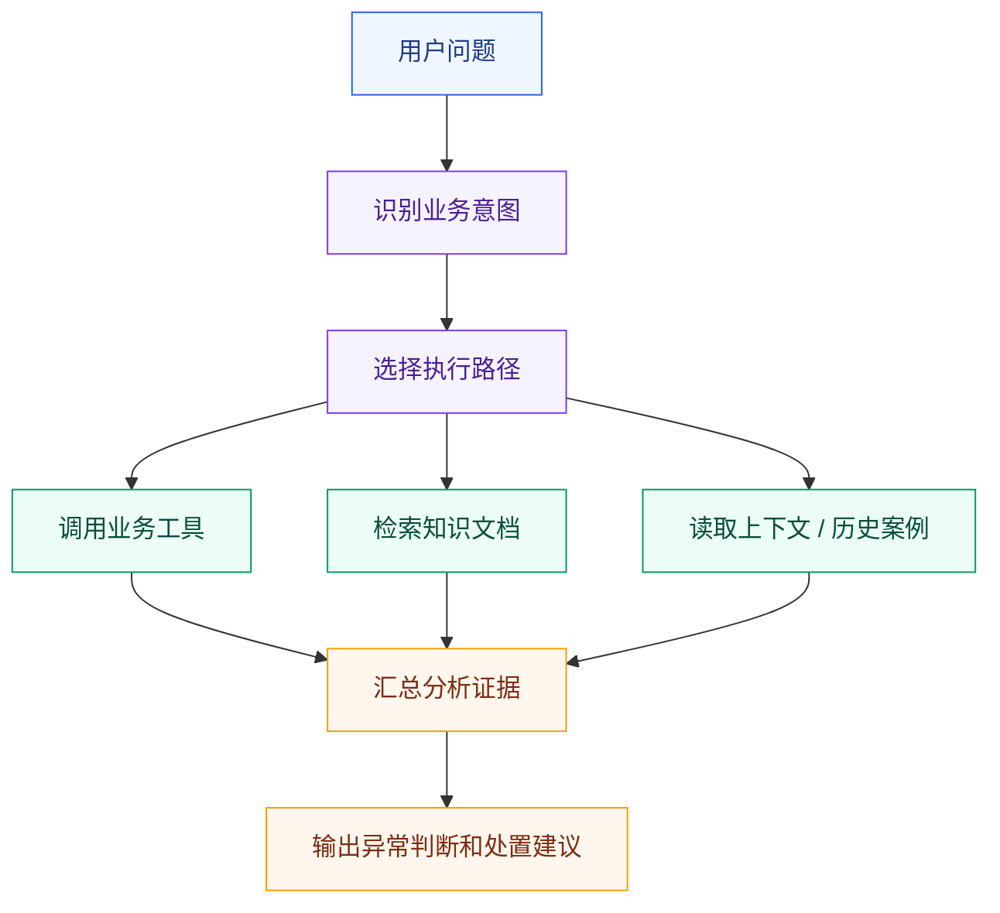
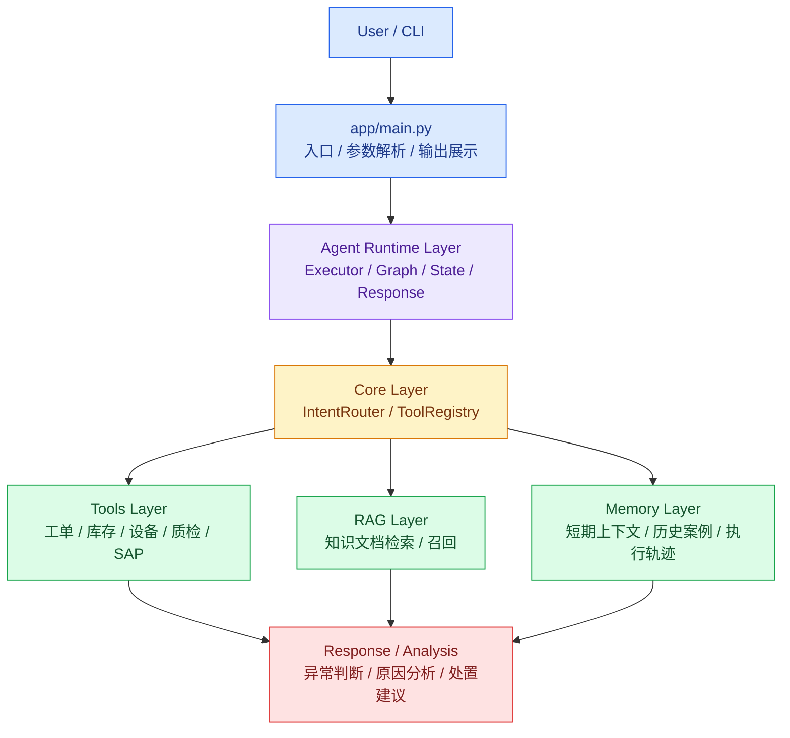
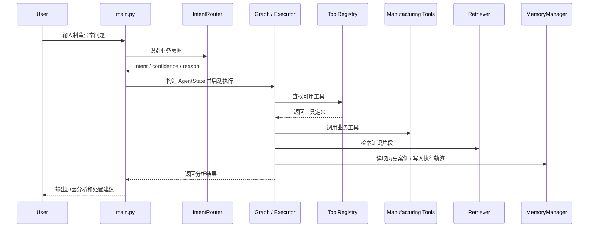

<div align="center">

# 🏭 Manufacturing Ops Agent

**面向制造运营异常分析场景的工程化 AI Agent 学习项目**

通过制造现场异常分析场景，系统训练 Agent 的 **架构分层、工具调用、知识检索、状态编排、记忆管理、可解释输出** 能力。

<br/>


</div>

---

## ✨ 项目定位

> **Manufacturing Ops Agent 不是一个一次性 demo，而是一个用于训练工程化 Agent 架构能力的长期学习项目。**

本项目以制造业现场异常分析为业务载体，逐步构建一个具备以下能力的工业 Agent 原型：

| 能力 | 目标 |
|---|---|
| 🧭 Intent Router | 识别用户问题所属业务意图 |
| 🧰 Tool Calling | 调用工单、库存、设备、质检、SAP 等业务工具 |
| 📚 RAG Knowledge Layer | 检索异常处理知识文档 |
| 🕸️ Orchestration Layer | 通过 Graph 显式化多步骤执行流程 |
| 🧠 Memory Layer | 管理短期上下文、历史案例、执行轨迹和用户偏好 |
| 📐 Engineering Quality | 体现架构分层、职责边界、可测试性和可扩展性 |

---

## 🧩 为什么做这个项目

在 MES / MOM / WMS 等制造系统中，现场异常通常不是单点问题，而是多个系统状态共同影响：

- 工单状态异常
- 库存扣减失败
- SAP 与本地系统库存不一致
- 设备报警或停机
- AGV / PLC / DCS 回传延迟
- 质检状态未完成
- 人工处置流程不标准

传统系统通常只展示数据，最终仍需要业务人员、现场工程师或系统工程师人工分析。

本项目将这个分析过程抽象为 Agent 执行链路：



---

## 🏗️ 整体架构设计

### 架构总览



### 核心调用链路



---

## 🧱 模块分层与职责边界

| 分层 | 目录 | 核心职责 | 不负责 |
|---|---|---|---|
| Entry | `app/main.py` | CLI 入口、参数解析、输出展示 | 不写业务规则，不直接访问数据 |
| Agent Runtime | `app/agent` | Agent 执行流程、状态编排、响应组织 | 不存放通用工具，不直接维护业务数据 |
| Core | `app/core` | 意图识别、工具注册等运行时基础设施 | 不写具体制造业务逻辑 |
| Tools | `app/tools` | 工单、库存、设备、质检、SAP 等业务工具 | 不决定 Agent 流程，不生成最终答案 |
| RAG | `app/rag` | 知识库加载、检索、召回 | 不替代业务工具，不替代 Memory |
| Memory | `app/memory` | 短期上下文、历史案例、执行轨迹、用户偏好 | 不替代数据库，不替代知识库 |
| Prompts | `app/prompts` | Prompt 模板、输出格式模板 | 不写执行流程 |
| Utils | `app/utils` | 无业务语义的通用函数 | 不放 IntentRouter、ToolRegistry、MemoryManager |
| Data | `data` | Mock 业务数据 | 不承载业务流程 |
| Docs | `docs` / `notes` | 每日学习记录、设计取舍、测试结果 | 不替代 README 总览 |

---

## 📐 设计原则

### 1. 架构先于代码

每一步学习实现都必须先说明：

```text
1. 当前能力属于 Agent 架构中的哪一层
2. 为什么现在引入这一层
3. 它和已有模块如何交互
4. 当前采用什么简化实现
5. 未来可以如何替换或扩展
```

### 2. 可扩展但不过度设计

> 当前阶段允许 Mock 数据和简化规则，但每个模块都要保留未来替换边界。

| 当前实现 | 未来扩展方向 |
|---|---|
| JSON Mock 数据 | MySQL / PostgreSQL / MES API / SAP API |
| Rule-based IntentRouter | LLM Intent Classifier / 多意图识别 |
| Python Function Tools | Tool Schema / Remote Tools / MCP Tools |
| Keyword Retriever | Embedding Retriever / Hybrid Search / Rerank |
| InMemory / JSON Memory | SQLite / PostgreSQL / Vector Memory |
| CLI 入口 | FastAPI / Web UI / 服务化接口 |
| 轻量 Graph 包装 | 多节点状态机 / 条件分支 / 错误恢复 |

### 3. 职责边界清晰

每个核心模块都要说明：

- 负责什么
- 不负责什么
- 当前为什么这样设计
- 未来如何扩展

---

## 🗂️ 目标项目结构

```text
manufacturing-ops-agent/
├── app/
│   ├── main.py
│   ├── agent/
│   │   ├── executor.py
│   │   ├── graph.py
│   │   └── state.py
│   ├── core/
│   │   ├── intent_router.py
│   │   └── tool_registry.py
│   ├── tools/
│   │   ├── work_order_tool.py
│   │   ├── inventory_tool.py
│   │   ├── device_tool.py
│   │   ├── quality_tool.py
│   │   ├── sap_tool.py
│   │   └── action_plan_tool.py
│   ├── rag/
│   │   ├── retriever.py
│   │   └── knowledge_base/
│   ├── memory/
│   │   ├── models.py
│   │   ├── store.py
│   │   └── manager.py
│   ├── prompts/
│   │   └── templates.py
│   └── utils/
│       └── json_loader.py
├── data/
├── docs/
│   ├── day1-notes.md
│   ├── day2-notes.md
│   ├── day3-notes.md
│   ├── day4-notes.md
│   └── day5-notes.md
├── tests/
├── README.md
└── LICENSE
```

---

## 🛠️ 当前技术栈

| 模块 | 当前选择 |
|---|---|
| 开发语言 | Python |
| 数据来源 | JSON Mock 数据 / Markdown 知识文档 |
| Agent 执行 | Rule-based Executor + 轻量 Graph 编排 |
| 意图识别 | IntentRouter |
| 工具管理 | ToolRegistry |
| 工具调用 | Python Function Tools |
| 知识检索 | Keyword Retriever |
| 状态编排 | LangGraph / 轻量 Graph Wrapper |
| 后续计划 | Memory、Prompt Governance、Evaluation、FastAPI |

---

## 🧰 当前支持的工具

| 工具 | 说明 |
|---|---|
| `get_work_order` | 根据工单号查询工单状态、物料、设备和当前异常 |
| `get_inventory` | 根据物料编码查询库存数量、冻结数量、可用数量和同步状态 |
| `get_device_status` | 根据设备编号查询设备状态、报警信息和是否允许继续生产 |
| `get_quality_result` | 根据工单号查询质检状态和质量风险 |
| `get_sap_sync_status` | 根据物料编码查询 SAP 与本地系统同步状态 |
| `create_action_plan` | 根据工单、库存、设备、质检、SAP 状态生成处置计划 |

---

## 🎯 当前支持的 Intent

| Intent | 说明 |
|---|---|
| `work_order_query` | 普通工单查询 |
| `work_order_exception_analysis` | 工单异常分析 |
| `unknown` | 未识别任务 |

---

## 🚀 运行方式

### 查看工具清单

```bash
python -m app.main --tools
```

### 普通工单查询

```bash
python -m app.main "查询工单 WO-001 的状态"
```

### 工单异常分析

```bash
python -m app.main "工单 WO-001 投料失败，请分析原因"
```

### RAG 检索验证

```bash
python -c "from app.rag.retriever import KeywordRetriever; r=KeywordRetriever(); chunks=r.retrieve('工单 WO-001 投料失败，SAP 同步失败，设备报警'); print([(c.source, c.score) for c in chunks])"
```

### 异常边界测试

```bash
python -m app.main "工单 WO-999 投料失败，请分析原因"
python -m app.main "你好"
```

---

## 🗺️ 学习进度

| Day | 主题 | 架构层 | 学习输入 | 输出文档 | 状态 |
|---|---|---|---|---|---|
| Day 1 | 最小工具调用闭环 | Tools Layer / Executor | Agent 工具调用基础 | [`docs/day1-notes.md`](./docs/day1-notes.md) | ✅ 已完成 |
| Day 2 | Agent 工程结构升级 | Core Layer | IntentRouter / ToolRegistry / ReAct 复习 | [`docs/day2-notes.md`](./docs/day2-notes.md) | ✅ 已完成 |
| Day 3 | RAG 知识库接入 | RAG Layer | 记忆与检索 / 知识召回 | [`docs/day3-notes.md`](./docs/day3-notes.md) | ✅ 已完成 |
| Day 4 | LangGraph 状态编排 | Orchestration Layer | 状态图 / Agent State / 节点编排 | [`docs/day4-notes.md`](./docs/day4-notes.md) | ✅ 已完成 |
| Day 5 | Memory Layer | Memory Layer | 短期上下文 / 历史案例 / 执行轨迹 | [`docs/day5-notes.md`](./docs/day5-notes.md) | 🔜 下一步 |
| Day 6 | Prompt 与输出治理 | Prompt / Response Layer | Prompt 模板 / 输出结构化 | `docs/day6-notes.md` | 🗓️ 计划中 |
| Day 7 | 多轮上下文 | Context Layer | 多轮追问 / 上下文继承 | `docs/day7-notes.md` | 🗓️ 计划中 |
| Day 8 | 错误处理与降级 | Reliability Layer | fallback / error handling | `docs/day8-notes.md` | 🗓️ 计划中 |
| Day 9 | 数据源适配层 | Data Adapter Layer | Mock 到真实数据源替换边界 | `docs/day9-notes.md` | 🗓️ 计划中 |
| Day 10 | 阶段性重构 | Architecture Review | v0.1 结构整理与复盘 | `docs/day10-notes.md` | 🗓️ 计划中 |

---

## 🧾 文档沉淀规则

本项目文档分为两层：

| 文档 | 职责 |
|---|---|
| `README.md` | 项目总览、整体架构、模块分层、演进路线、文档索引 |
| `docs/dayX-notes.md` | 每日学习过程、设计取舍、实现细节、测试结果、复盘结论 |

### README.md 记录

- 项目背景
- 项目目标
- 整体架构设计
- 模块分层与职责边界
- 核心调用链路
- 技术栈
- 项目结构
- 学习进度
- docs 索引
- 当前限制与后续路线

### docs / notes 记录

每一天的 notes 文档至少包含：

```text
1. 当天学习输入
2. 当天解决的架构问题
3. 新增或调整的模块
4. 模块职责边界
5. 当前简化实现
6. 未来扩展方向
7. 测试命令与测试结果
8. 当天复盘结论
```

---

## 📌 当前阶段成果

<details open>
<summary><strong>Day 1：最小工具调用闭环</strong></summary>

架构意义：建立 Agent 最小执行闭环。

完成内容：工单查询工具、库存查询工具、设备状态查询工具、多工具串联调用、工业异常分析输出。

详细记录见：[`docs/day1-notes.md`](./docs/day1-notes.md)

</details>

<details open>
<summary><strong>Day 2：Agent 工程结构升级</strong></summary>

架构意义：抽离 Agent Runtime 的基础设施能力。

完成内容：新增 `IntentRouter`、调整 `ToolRegistry`、`Executor` 接入意图路由、明确 `core` / `agent` / `tools` / `utils` 包边界。

详细记录见：[`docs/day2-notes.md`](./docs/day2-notes.md)

</details>

<details open>
<summary><strong>Day 3：RAG 知识库接入</strong></summary>

架构意义：引入 Knowledge Layer，让 Agent 不只依赖业务工具，也能读取异常处理知识。

完成内容：新增知识库文档、Keyword Retriever、分析过程接入知识召回结果、输出中体现知识来源和命中情况。

详细记录见：[`docs/day3-notes.md`](./docs/day3-notes.md)

</details>

<details open>
<summary><strong>Day 4：LangGraph 状态编排</strong></summary>

架构意义：引入 Orchestration Layer，让 Agent 的执行流程从隐式代码调用变为显式状态编排。

完成内容：新增 Agent State、轻量 Graph 包装、Graph 只负责流程编排、Executor 继续负责业务执行。

详细记录见：[`docs/day4-notes.md`](./docs/day4-notes.md)

</details>

---

## ⚠️ 当前限制与后续方向

| 限制 | 当前情况 | 后续方向 |
|---|---|---|
| 数据仍是假数据 | 当前使用 JSON Mock 数据 | 通过 Data Adapter 替换为数据库或业务系统 API |
| 意图识别较简单 | 当前主要规则匹配 | 替换为 LLM Intent Classifier |
| RAG 检索较简单 | 当前使用关键词匹配 | 替换为 Embedding / Hybrid Search |
| Memory 尚未完成 | 当前还未形成完整记忆层 | Day 5 引入 Memory Layer |
| 未提供 Web API | 当前主要通过 CLI 运行 | 后续接入 FastAPI |
| 未建立评估体系 | 暂无系统化评估指标 | 后续设计 Evaluation Case |

---

## 🧠 下一步：Day 5 Memory Layer

> Day 5 不做简单聊天记录，而是在 Agent 架构中引入 Memory Layer。

### Day 5 目标

- 管理短期上下文
- 读取历史异常案例
- 记录本次执行轨迹
- 为未来用户偏好记忆预留边界

### Day 5 计划新增

```text
app/memory/
├── models.py
├── store.py
└── manager.py
```

### Day 5 完成标准

- Agent 能读取历史案例辅助分析
- Agent 能记录本次执行轨迹
- Agent 输出中能说明是否使用了 Memory
- 不引入复杂数据库
- 不破坏 Day 1-4 现有结构
- 在 `docs/day5-notes.md` 中记录设计理由、职责边界、测试结果和扩展方向

---

<div align="center">

**当前阶段目标：形成 v0.1 工程化 Agent 原型，而不是停留在一次性 demo。**

</div>
